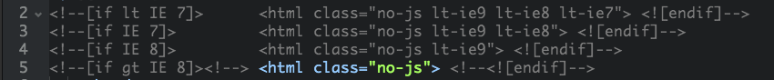
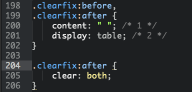
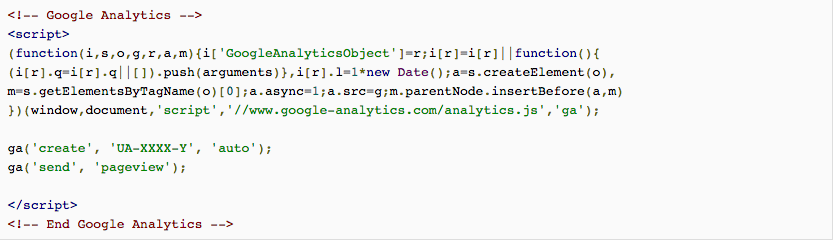

# 以 HTML5 Boilerplate 为基础的前端面试题


## 要点：
  **题目类型**：技术视野、项目细节、理论知识、案例题  
  **进行追问**：延展问题的广度和深度，得知真实实力。因为关联性知识是长期学习获得，难以依靠临时记得。
  
  
## 关于IE hack，条件注释 <html> 相比 CSS hack 的优势是？  


**追问：**  
* 日常开发中，是否进行过 IE 兼容的开发，采取过什么样的方式处理？  
* 对 Modernizr.js 是否了解，讲讲它的运行机制。如不了解，谈下对于渐进增强和优雅降级之间的理解？

延伸阅读：[Conditional Stylesheets vs CSS Hacks? Answer: Neither!](http://www.paulirish.com/2008/conditional-stylesheets-vs-css-hacks-answer-neither/)

## 网站的 SEO 可以从前端那些方面进行优化？
```
<title></title>
<meta name="description" content=“”>
```

**追问：**  
* 关于 HTML 语义化 `<h1>、<h2>、<h3>` 与 `<strong>、<b>、<em>` 的意义以及何时使用 ？  
* 谈下关于 http 200 和 304 分别代表的意义，以及 AJAX 状态有哪几种，你常用的状态是？  
* 请解释 JSONP 的工作原理，以及它为什么不是真正的 AJAX？

延伸阅读：[浅谈前端与SEO](http://uxc.360.cn/archives/984.html)

## Normalize.css 和 Reset.css 的区别？ 
```
<link rel="stylesheet" href="css/normalize.css”>
```

**追问：**  
Normalize.css 的作者 necolas 提出 「A new micro clearfix hack」，请你谈谈其工作原理，以及你还有其他清除浮动的技巧吗？（以下为代码）



延伸阅读：[A new micro clearfix hack](http://nicolasgallagher.com/micro-clearfix-hack/)

## 关于 jQuery，请指出 $ 和 $.fn 的区别，或者说出 $.fn 的用途？
```
src="//ajax.googleapis.com/ajax/libs/jquery/1.10.2/jquery.min.js"
```

**追问：**  
* 能否使用原生 javascripts 写一个弹窗效果，讲讲其原理，以及需要注意的地方？  
* 除了可以使用 CDN 提升前端性能，还有什么可以提升前端性能的方式？  
* 当网站带有大量图片，如何专门针对图片进行性能优化？  


## Google Analytics 采用的是什么加载方式？谈你你了解的 javascripts 加载方式有哪几种？


**追问：**  
* AMD 与 CommonJS 的区别？  
* 对 NodeJS 有实践经验吗？如果谈谈你做过相关的项目？


## Last: 
**日常如何了解前端资讯和学习前端知识？**